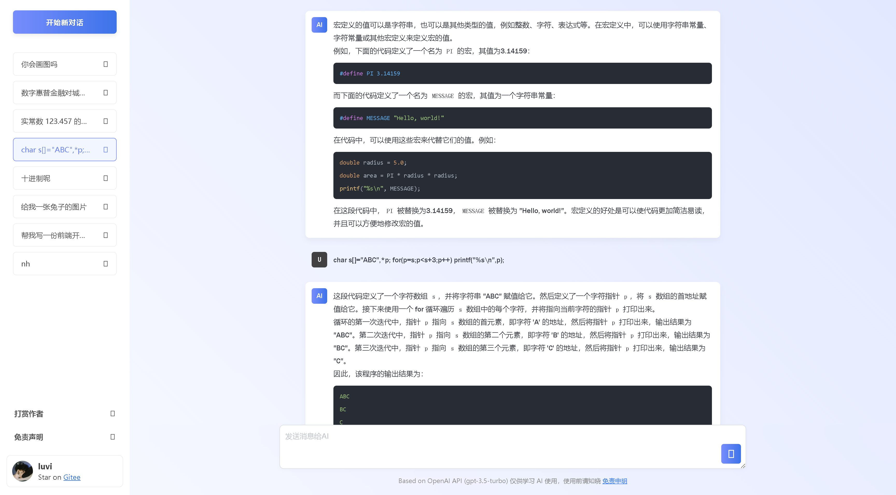
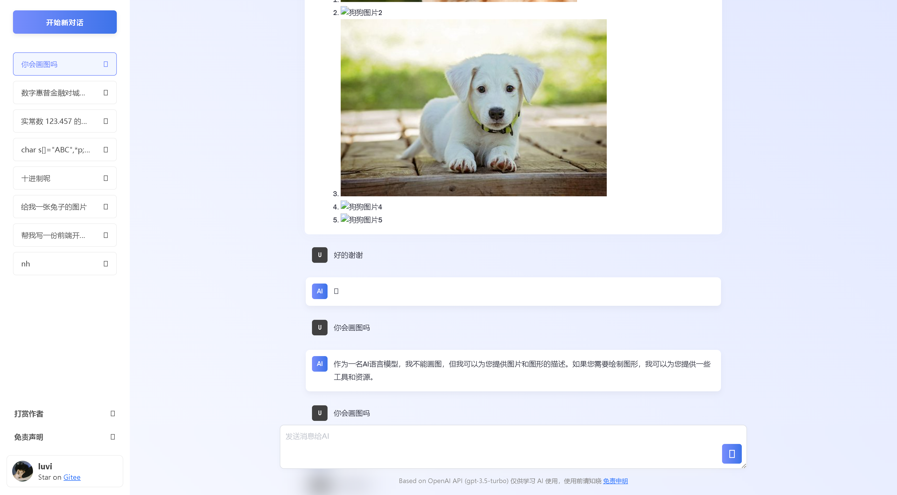
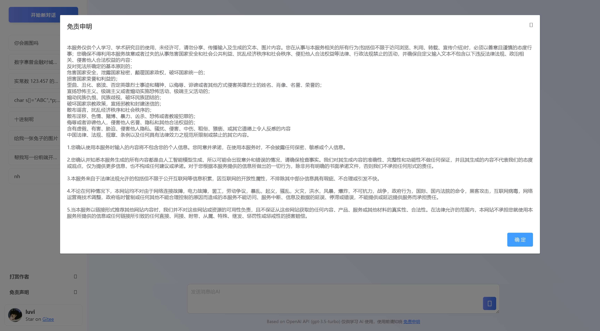
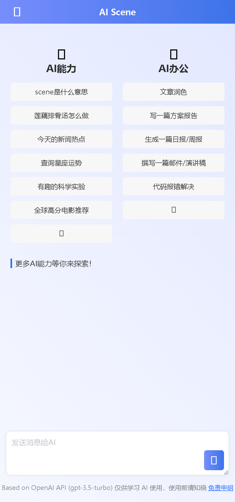
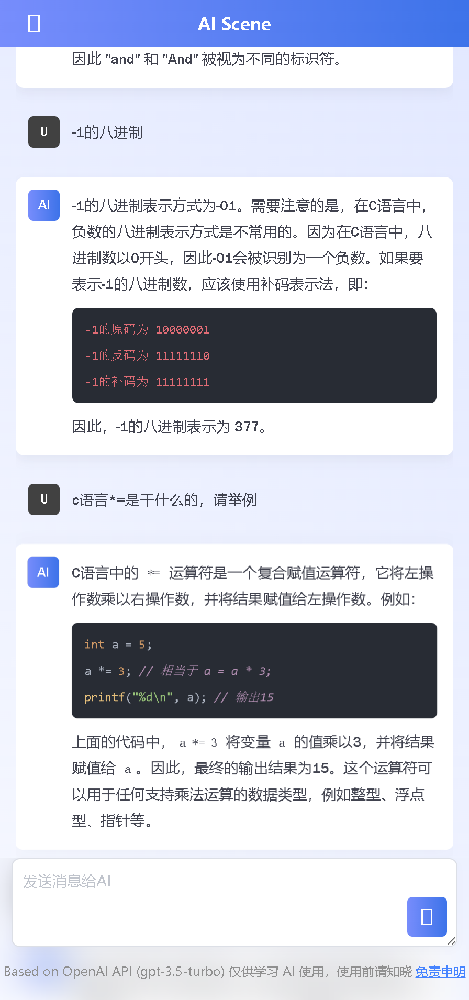
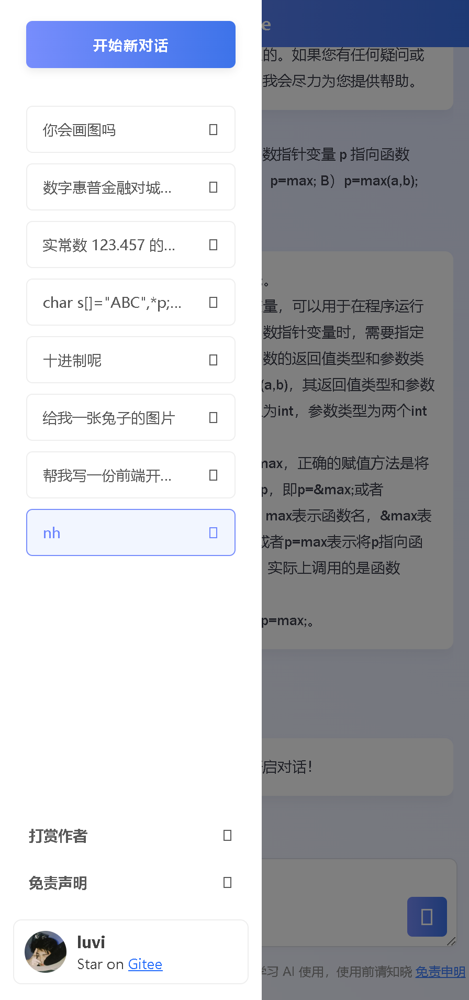
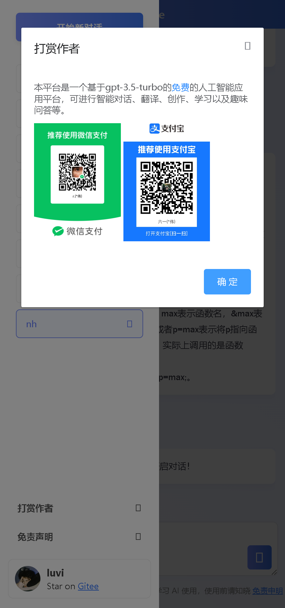

# 酒店管理ai助手

> 这是一个基于Vue的酒店管理AI助手客户端

## 项目简介

酒店管理ai助手是一个专业的酒店管理辅助工具，提供以下功能：
- 酒店运营管理策略
- 客户服务管理方法
- 团队管理最佳实践
- 成本控制与优化
- 市场营销策略
- 质量管理与改进

## Build Setup

``` bash
# install dependencies
npm install

# serve with hot reload at localhost:8080
npm run dev

# build for production with minification
npm run build

# build for production and view the bundle analyzer report
npm run build --report
```

For a detailed explanation on how things work, check out the [guide](http://vuejs-templates.github.io/webpack/) and [docs for vue-loader](http://vuejs.github.io/vue-loader).


## 界面截图





##移动端



